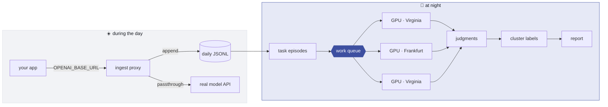
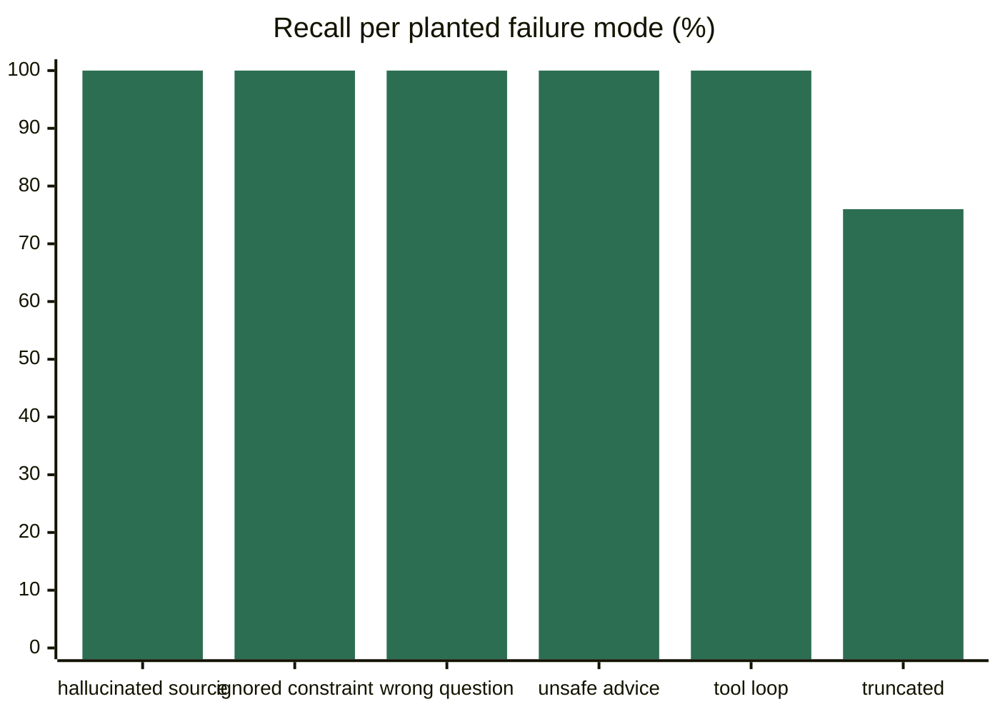
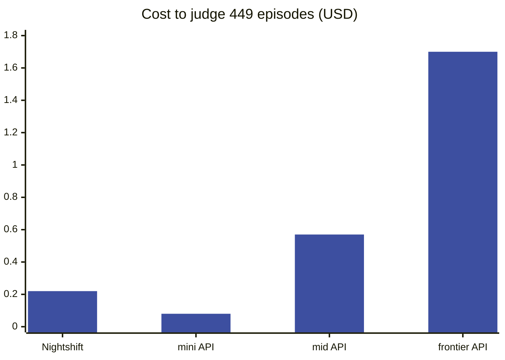

<div align="center">

# 🌙 Nightshift

**Judge 100% of your LLM traces, not 2% — on rented consumer GPUs, overnight.**

[](https://dispersed.com)
[](requirements.txt)
[](nightshift/mcp_server.py)
[](#what-it-actually-costs)
[](#does-it-actually-work)

</div>

---

## The problem

Every LLM observability tool judges a **sample** of your traces. Not because sampling is
good — because each LLM-as-judge call costs frontier-API money, so judging all of them
doesn't pencil out. You end up flying on 2% of your data and hoping it's representative.

Nightshift flips the economics. It captures every call, accumulates them through the day,
then **bursts a pool of GPUs on the [Dispersed](https://dispersed.com) network** — idle
consumer cards rented by the hour — judges *every* trace with a 27B model, clusters the
failures, and tears the pool down. You pay for GPU-minutes, not per token.

```
449 episodes · 3 × RTX 5090 · 2 continents · 389 seconds · 0 errors · $0.22
```

## How it works



| Stage | What it does | Module |
|---|---|---|
| **Ingest** | Transparent OpenAI/Anthropic proxy. One env var, zero app changes. | [`proxy.py`](nightshift/proxy.py) |
| **Accumulate** | Append-only daily JSONL | [`store.py`](nightshift/store.py) |
| **Schedule** | Nightly trigger | [`scheduler.py`](nightshift/scheduler.py) |
| **Engine** | Provision GPUs → burst-judge every episode → tear down | [`fleet.py`](nightshift/fleet.py) · [`judge.py`](nightshift/judge.py) |
| **Report** | Scorecard, ranked failure taxonomy, real cost | [`cluster.py`](nightshift/cluster.py) · [`report.py`](nightshift/report.py) |
| **Control** | MCP server — ask Claude to run it and query it | [`mcp_server.py`](nightshift/mcp_server.py) |

## Quick start

```bash
git clone <this repo> && cd nightshift
pip install -r requirements.txt
cp .env.example .env            # add your Dispersed pk_ / sk_ pair

python3 tools/mockgen.py        # generate the 1052-episode demo corpus
./ns show --day 2026-08-25      # look at what gets shipped to the GPUs
./ns warm --fleet 6             # rent GPUs (~1–9 min; over-provision, some fail)
./ns run --reuse --day 2026-08-25 --limit 60
./ns report                     # results
./ns kill                       # ALWAYS. Jobs bill until cancelled.
```

No GPUs? `./ns run --endpoint http://127.0.0.1:8081` runs the whole pipeline against any
local OpenAI-compatible server — see [`LOCAL_JUDGE.md`](LOCAL_JUDGE.md).

## Does it actually work?

The demo corpus has **six failure modes deliberately planted** in it, recorded in
`data/ground_truth.json`. Their names never appear in the trace text — the judge has to
read and infer. On a 449-episode run it recovered **159 of 165**:



Recall **96%**, precision 65%. The unplanted episodes it also flagged aren't necessarily
wrong — a trace can be weak without carrying a planted defect. Reproduce with
`python3 tools/validate.py`.

It also **named eight failure modes on its own**, ranked by frequency — *Execution and
State Hallucination* (agents claiming to have run tools they never ran) topped the list
at 61 episodes.

## What it actually costs

Same 449-episode corpus, judged by a hosted model instead:



| Judge | Cost | vs Nightshift |
|---|---|---|
| **Nightshift** — 27B on 3× RTX 5090 | **$0.22** | — |
| Frontier API (≈$3 / $15 per Mtok) | $1.70 | **7.6× cheaper** |
| Mid API (≈$1 / $5) | $0.57 | **2.5× cheaper** |
| Mini API (≈$0.15 / $0.60) | $0.08 | 2.9× *more expensive* |

> [!NOTE]
> We lose to a mini model on raw price — and we say so. That's a mini judging your
> traces versus a 27B, with no rate limits and no customer data leaving for a vendor.
> And GPU-hours are fixed: **ten nodes judges the same corpus in seven minutes for the
> same $0.22.** No hosted API sells that shape.

Cost is charged as *nodes × burst wall-clock*, from Dispersed's own billing fields. Idle
warm-pool time is reported separately, never hidden in the per-episode number.

## The unit of judgment

Not a session (a 450KB transcript blows any context window) and not a message (too small
to have an outcome), but a **task episode**: one user request through to its resolution.
Each becomes exactly one GPU call returning schema-constrained JSON:

```json
{"scores": {"instruction_following": 4, "correctness": 2, "efficiency": 3},
 "verdict": "fail",
 "failure_label": "hallucinated order status",
 "evidence": "Claims the refund was issued; no tool call or confirmation appears."}
```

A second pass reads **only the labels** and clusters them into named modes — one cheap
call regardless of corpus size.

## Ask it in English

```bash
claude mcp add nightshift -- ./mcp_launch.sh
```

Then, in Claude Code: *"What did my agent screw up yesterday?"* → `failure_modes` →
`episodes_in_cluster` for the receipts. Six tools: `ingest_status`, `preview_episodes`,
`run_nightly_batch`, `last_report`, `failure_modes`, `episodes_in_cluster`.

## Building on Dispersed — four things the docs don't tell you

Each of these independently broke the pipeline. They're in the commit history too.

1. **`POST /v1/jobs` populates `node_urls`. The recipe `cook` endpoint doesn't.** A job
   cooked from a recipe reaches `RUNNING` with an empty `node_urls[]` and is unreachable.
2. **A `ports` list *replaces* the default set.** Omit `22` and SSH is never published,
   so the node never reports any URL at all. Always `[22, <your port>]`.
3. **The llama.cpp image runs in router mode** — every request needs an explicit `model`,
   discovered from `/v1/models`. Without it: `400 model name is missing`.
4. **Qwen3 is a reasoning model.** Left on, it spends the whole token budget on hidden
   thinking and returns *empty content*. `chat_template_kwargs: {"enable_thinking": false}`
   is ~5× faster and ~5× cheaper per judgment.

Also: published container ports are proxied at `*.proxy.dispersed.com:<external>`, so
direct HTTP works with no tunnel. SSH tunnelling is kept as the fallback.

## Operational truths

These are strangers' machines, and the design assumes it.

- **Nodes die mid-run.** The burst is a work queue, not static sharding — a dead node's
  episodes get picked up by whoever is free. Watching `errs` climb while the run
  completes anyway is the system working.
- **Over-provision.** Ask for 6, expect 4. Some nodes never finish the 22GB image pull.
- **Results persist before post-processing.** Judgments hit disk the instant judging ends;
  a billing-API hiccup can't discard paid-for GPU work. (It did, once. Not again.)
- **Teardown is belt-and-braces.** `atexit` + signal handlers + `tools/killall.py`, which
  retries until the API *confirms* zero live jobs. A silently failed teardown is the one
  bug that keeps costing money.
- **Once nodes are warm, the control plane is optional.** Inference goes direct to the
  GPUs; a Dispersed API stall slows provisioning, not judging.

## Repo map

```
nightshift/         the package — one module per stage
ns                  CLI: proxy · status · show · warm · pool · run · report · demo · kill
tools/
  mockgen.py        seeded 1052-episode corpus with six planted failure modes
  validate.py       recall / precision against ground truth
  finish_report.py  rebuild a report from saved judgments
  killall.py        confirmed teardown
demo/               CLAUDE.md — a fresh Claude session can run the demo unaided
DEMO.md             presenter runbook with talking points
MOCKDATA.md         corpus composition
LOCAL_JUDGE.md      running without GPUs
```

## Honest limitations

- Traces go to third-party GPU nodes **unredacted**. A deliberate hackathon tradeoff; a
  redaction pass belongs in front of the proxy before anyone runs this on real data.
- One batch, no history. Regression detection between nights is the obvious next piece
  — the engine already emits everything it needs.
- Cold start on a node that hasn't cached the image is ~9 minutes. Warm ahead.
- Built in one sitting at a hackathon. It works; it is not hardened.

---

<div align="center">
<sub>Built on the <a href="https://dispersed.com">Dispersed Network</a> · judged by Qwen3-27B on rented RTX 5090s</sub>
</div>
